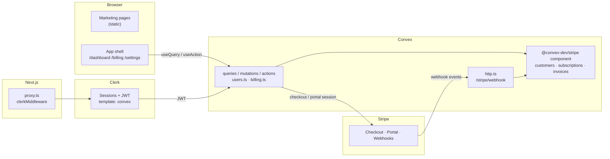

# SABLE — SaaS Starter

Auth, billing, and a realtime backend, wired end-to-end. Clone it, add keys, ship your product.


**Stack:** Next.js App Router · TypeScript · Tailwind CSS v4 · shadcn/ui · [Clerk](https://clerk.com) · [Convex](https://convex.dev) · [`@convex-dev/stripe`](https://github.com/get-convex/stripe)

**What you get:**

- A premium marketing site (the "SABLE" demo brand — see [`DESIGN.md`](./DESIGN.md))
- Sign-in / sign-up pages styled to the design system
- A protected app shell: dashboard, billing, settings
- Stripe subscriptions: Checkout, Customer Portal, cancel/resume, invoice history
- Users synced from Clerk into your Convex database
- `npm run build` passes with zero env vars — missing keys fail at runtime with clear errors

## Quickstart

Fifteen minutes, three dashboards. Uses `npm` throughout.

```bash
git clone https://github.com/RayFernando1337/saas-starter my-app
cd my-app
npm install
cp .env.example .env.local
```

1. **Convex** — `npx convex dev` (keep it running). First run prompts a one-time login and writes `CONVEX_DEPLOYMENT` + `NEXT_PUBLIC_CONVEX_URL` into `.env.local`.
2. **Clerk** — create an app at [dashboard.clerk.com](https://dashboard.clerk.com), copy both API keys into `.env.local`, then follow [Auth setup](#auth-setup-clerk--convex) below (2 minutes, one JWT template).
3. **Stripe** — follow [Stripe setup](#stripe-setup) below (product, webhook, three env vars).
4. **Run it** — `npm run dev` in a second terminal. Open [http://localhost:3000](http://localhost:3000).

Sign up, hit **Billing**, subscribe with card `4242 4242 4242 4242` — the subscription appears in your dashboard in realtime.

## Architecture



Route groups:

```
app/
├── (marketing)/        # public: landing, pricing — statically prerendered
├── (auth)/             # public: /sign-in, /sign-up — Clerk components
└── (app)/              # protected: /dashboard, /billing, /settings
convex/
├── schema.ts           # users table
├── users.ts            # current + store (Clerk → Convex sync)
├── billing.ts          # checkout, portal, subscriptions, invoices, cancel/resume
├── http.ts             # Stripe webhook route
├── convex.config.ts    # installs the Stripe component
└── auth.config.ts      # Clerk JWT verification
```

`proxy.ts` (Next.js 16's middleware) protects `/dashboard`, `/billing`, and `/settings`; everything else is public.

## Auth setup (Clerk + Convex)

Clerk issues a JWT that Convex verifies. One-time dashboard work:

1. In the [Clerk dashboard](https://dashboard.clerk.com): **Configure → JWT templates → New template → Convex**. Keep the name exactly `convex`. Save.
2. On the same page, copy the **Issuer** URL (looks like `https://your-app.clerk.accounts.dev`).
3. Give it to Convex (this is a Convex deployment variable, not `.env.local`):

   ```bash
   npx convex env set CLERK_JWT_ISSUER_DOMAIN https://your-app.clerk.accounts.dev
   ```

4. Put your Clerk API keys in `.env.local` (**API keys** page):

   ```bash
   NEXT_PUBLIC_CLERK_PUBLISHABLE_KEY=pk_test_...
   CLERK_SECRET_KEY=sk_test_...
   ```

`convex/auth.config.ts` reads the issuer domain; the `convex` template name matches its `applicationID`. On first sign-in, `hooks/use-store-user.ts` calls `users.store` and upserts the user into the `users` table (indexed by `tokenIdentifier`).

## Stripe setup

The [`@convex-dev/stripe`](https://github.com/get-convex/stripe) component runs inside your Convex deployment: it creates Checkout and Portal sessions, receives webhooks, and mirrors customers, subscriptions, payments, and invoices into component tables you can query.

### 1. Create the product

In the [Stripe dashboard](https://dashboard.stripe.com/test/products) (Test mode): **Product catalog → Add product**. Name it (e.g. "Pro"), add a **recurring** price (e.g. $20/month), save, and copy the **price ID** (`price_...`, not `prod_...`) into `.env.local`:

```bash
NEXT_PUBLIC_STRIPE_PRICE_PRO=price_...
```

### 2. Set Convex env vars

```bash
npx convex env set STRIPE_SECRET_KEY sk_test_...       # Stripe → Developers → API keys
npx convex env set SITE_URL http://localhost:3000      # where Stripe redirects back to
```

### 3. Create the webhook

Your webhook URL is your Convex deployment's **HTTP Actions URL** plus `/stripe/webhook`:

```
https://<your-deployment>.convex.site/stripe/webhook
```

Note **`.convex.site`**, not `.convex.cloud`. Find the deployment name in the Convex dashboard or in `CONVEX_DEPLOYMENT` in `.env.local`.

In [Stripe → Developers → Webhooks](https://dashboard.stripe.com/test/webhooks) → **Add endpoint**, paste the URL and select exactly these events:

- `checkout.session.completed`
- `customer.created`
- `customer.updated`
- `customer.deleted`
- `customer.subscription.created`
- `customer.subscription.updated`
- `customer.subscription.deleted`
- `invoice.created`
- `invoice.finalized`
- `invoice.updated`
- `invoice.paid`
- `invoice.payment_failed`
- `payment_intent.succeeded`
- `payment_intent.payment_failed`

Then copy the endpoint's **Signing secret**:

```bash
npx convex env set STRIPE_WEBHOOK_SECRET whsec_...
```

### 4. Test

Sign in, open **Billing**, click **Upgrade**. Use test card `4242 4242 4242 4242`, any future expiry, any CVC. After redirect the subscription card, invoice table, and dashboard plan badge update in realtime.

Server-side wiring lives in `convex/billing.ts` (checkout, portal, cancel, resume, queries) and `convex/http.ts` (webhook route).

## Customizing

The demo brand is **SABLE**; the design language is documented in [`DESIGN.md`](./DESIGN.md).

| What | Where |
| --- | --- |
| Colors, radius, type scale | `app/globals.css` (`:root` tokens + `@theme`) |
| Brand name | Search for "SABLE" / "Sable" — nav, footer, hero, metadata in `app/layout.tsx` |
| Plans + pricing copy | `lib/plans.ts` (used by marketing and billing pages) |
| Landing sections | `components/marketing/sections/*` — each section is a standalone component |
| Demo imagery | `lib/assets.ts` — swap CDN URLs for your own |
| Auth appearance | `lib/clerk-appearance.ts` |
| Protected routes | `proxy.ts` (`isProtectedRoute` matcher) |

Adding a paid feature: gate it with `isEntitled(subscription)` from `lib/subscription.ts` on the client, or query `components.stripe.public.listSubscriptionsByUserId` inside a Convex function for server-side checks.

## Deploy

### Convex (production)

```bash
npx convex deploy
```

Set the production deployment's env vars (Convex dashboard → Settings → Environment Variables): `CLERK_JWT_ISSUER_DOMAIN`, `STRIPE_SECRET_KEY`, `STRIPE_WEBHOOK_SECRET`, and `SITE_URL=https://yourdomain.com`. Create a **second Stripe webhook** pointing at the production `.convex.site` URL, with its own signing secret.

### Vercel

Import the repo, then set the build command so Convex deploys with each push:

```bash
npx convex deploy --cmd 'npm run build'
```

Add `CONVEX_DEPLOY_KEY` (Convex dashboard → Settings → Deploy key) plus the `NEXT_PUBLIC_CLERK_PUBLISHABLE_KEY`, `CLERK_SECRET_KEY`, Clerk routing vars, and `NEXT_PUBLIC_STRIPE_PRICE_PRO` to Vercel env vars. `npx convex deploy` injects `NEXT_PUBLIC_CONVEX_URL` automatically. Switch Clerk to a production instance and update `CLERK_JWT_ISSUER_DOMAIN` accordingly.

## Troubleshooting

**Stripe tables are empty after checkout.** The webhook isn't reaching Convex. Verify the URL ends in `.convex.site/stripe/webhook`, `STRIPE_WEBHOOK_SECRET` is set on the deployment (`npx convex env list`), and the event list above is selected — `invoice.created` and `invoice.finalized` matter, not just `invoice.paid`. Check Stripe → Webhooks → your endpoint → event log for delivery failures.

**"Not authenticated" from Convex functions.** The JWT template must be named exactly `convex`, `CLERK_JWT_ISSUER_DOMAIN` must be set on the Convex deployment (then re-run `npx convex dev` to push `auth.config.ts`), and the user must be signed in before calling actions.

**Webhook returns 400.** Signature verification failed: wrong `STRIPE_WEBHOOK_SECRET` (each endpoint has its own), or you're sending live-mode events to a test-mode key. Convex dashboard → Logs shows the error.

**Build fails / blank keys.** `npm run build` needs no env vars — marketing pages are static, app pages render per-request. If a page throws `Missing environment variable ...` at runtime, copy `.env.example` to `.env.local` and fill the named key.

**`convex/_generated` types out of date.** Run `npx convex dev` (or `npx convex codegen`) after changing files in `convex/`.

## Scripts

| Command | What it does |
| --- | --- |
| `npm run dev` | Next.js dev server |
| `npx convex dev` | Convex dev deployment + codegen (run alongside) |
| `npm run build` | Production build + typecheck |
| `npm run lint` | ESLint |

## License

MIT. The decision log behind the template is in [`DECISIONS.md`](./DECISIONS.md).
